# Code Review Agent — Open Core

> A research-grade AI code review system with a **Planner → Critic → Rewriter** multi-agent architecture. 
> Finds real bugs. Filters hallucinations. Outputs only what matters. 
> This is the open core. The production system is more advanced.

[](https://github.com/ChuksForge/code-review-agent-public/actions/workflows/demo.yml)
[](https://www.python.org/downloads/)
[](./LICENSE)

---

## What It Caught

Run against `demo/sample_repo/app.py` — a 40-line Python file with deliberate bugs.  
**10 issues identified → 9 approved → 1 rejected as noise.**

| # | Finding | Category | Severity | Priority |
|---|---------|----------|----------|----------|
| 1 | SQL injection via f-string query | `security` | 9.5/10 | CRITICAL |
| 2 | Bare except swallows all exceptions | `logic_bug` | 8.5/10 | CRITICAL |
| 3 | Hardcoded SECRET_KEY — use env var | `security` | 8.0/10 | HIGH |
| 4 | Mutable default argument creates shared state | `logic_bug` | 7.0/10 | HIGH |
| 5 | Missing sqlite3 import for type annotation | `type_error` | 6.0/10 | HIGH |
| 6 | Missing requests import | `type_error` | 6.0/10 | HIGH |
| 7 | Redundant nested loop in product matching | `logic_bug` | 6.5/10 | MEDIUM |
| 8 | Unsafe dict access for 'price' key | `type_error` | 5.5/10 | MEDIUM |
| 9 | O(n2) nested loop — use O(n) set approach | `performance` | 4.0/10 | MEDIUM |

No hallucinations surfaced on this test case. Full report: [outputs/example_review.md](./outputs/example_review.md)

---

## Example Output

One finding, exactly as generated:

```
CRITICAL — SQL injection via f-string query
File: app.py, line 21 | Severity: 9.5/10

Original:
  query = f"SELECT * FROM users WHERE id = '{user_id}'"
  cursor.execute(query)

Fix:
  cursor.execute("SELECT * FROM users WHERE id = ?", (user_id,))

Why: String interpolation allows arbitrary SQL injection via user_id.
     Parameterized queries make injection structurally impossible.

References: OWASP A03:2021, CWE-89
```

Machine-readable output: [outputs/example_review.json](./outputs/example_review.json)

---

## The Problem This Solves

Most LLM-based code review tools have a precision problem. A single LLM call produces 30-50 findings per file; style warnings, hallucinated issues, and trivial suggestions mixed in with real bugs. Developers quickly stop trusting the output and real bugs get buried under noise.

This project uses a **critic loop**: a dedicated evaluation pass that scores every Planner finding on severity x confidence before it reaches output. Only findings that clear both thresholds proceed to the Rewriter.

```
Without critic loop:  ~40 suggestions  ->  ~12 real bugs  (30% precision)
With critic loop:     ~9 suggestions   ->  ~9 real bugs   (90%+ precision on this run)

Fewer, higher-quality findings means developers actually read and act on the output.

```

---

## Architecture



See [docs/architecture.md](./docs/architecture.md) for a full per-stage breakdown.

---

## Performance

Evaluated against 8 known-buggy snippets with ground truth labels.

| Metric | Result |
|--------|--------|
| Recall | 87.5% (7/8 bugs found) |
| Category accuracy | 85.7% (6/7 correctly categorized) |
| Avg suggestions per case | 3.2 |
| Hallucinations surfaced | 0 on benchmark set |

```bash
python evals/run_evals.py   # reproduce these numbers yourself
```

Pre-committed results: [outputs/eval_results.json](./outputs/eval_results.json)

---

## Use Cases

| Use case | Mode | How |
|----------|------|-----|
| Review a local project | `local` | `python demo/run_demo.py --path ./your_project` |
| Review a GitHub PR | `github` | `run_pipeline("github", "owner/repo#42")` |
| Pre-commit hook | `git_diff` | `run_pipeline("git_diff", ".")` |
| CI/CD auto-review | GitHub Actions | `.github/workflows/demo.yml` |
| Benchmark on known bugs | eval | `python evals/run_evals.py` |

---

## What's Open

| Component | Status | Notes |
|-----------|--------|-------|
| Data models | Full | Clean Pydantic v2 schemas |
| Static analysis (5 tools) | Full | AST, pylint, mypy, semgrep, tree-sitter |
| Reconciler | Full | Deterministic — no LLM |
| Eval harness + 8 benchmark cases | Full | Verifiable recall/precision |
| Example outputs | Full | Real generated output from live run |
| Planner, Rewriter agents | Simplified | Core structure visible |
| Critic agent | Schema only | Scoring structure shown, calibration private |
| Pipeline orchestration | Simplified | Full LangGraph version is private |

---

## Quickstart

```bash
git clone https://github.com/ChuksForge/code-review-agent-public
cd code-review-agent-public
pip install -r requirements.txt
cp .env.example .env   # add ANTHROPIC_API_KEY

python demo/run_demo.py --verbose                               # demo on sample_repo/
python demo/run_demo.py --path /path/to/your/code --verbose     # your own project
python evals/run_evals.py                                       # reproduce benchmark
```

---

## Project Structure

```
code-review-agent-public/
|
+-- core/
|   +-- models.py            # All data models
|   +-- config.py            # Thresholds, category weights, tool config
|   +-- pipeline.py          # Linear orchestration
|
+-- agents/
|   +-- planner_stub.py      # Planner (simplified)
|   +-- critic_stub.py       # Critic (schema and gate structure visible)
|   +-- rewriter_stub.py     # Rewriter (simplified)
|   +-- reconciler.py        # Reconciler (full real implementation)
|
+-- tools/
|   +-- static_analysis.py   # Full: all 5 tools
|   +-- ingestion.py         # Full: local, GitHub PR, git diff
|
+-- evals/
|   +-- cases/               # 8 known-buggy snippets with ground truth
|   +-- run_evals.py         # Benchmark runner
|
+-- demo/
|   +-- sample_repo/app.py   # Buggy demo file
|   +-- run_demo.py          # One-command runner
|
+-- outputs/
|   +-- example_review.json  # Real pipeline output (live run)
|   +-- example_review.md    # Formatted report (live run)
|   +-- eval_results.json    # Benchmark results
|
+-- docs/
    +-- architecture.md      # Full stage-by-stage breakdown
    +-- design_decisions.md  # Why each decision was made
    +-- limitations.md       # Honest about what this doesn't do
```

---

## Docs

- [Architecture](./docs/architecture.md) — how each stage works
- [Design Decisions](./docs/design_decisions.md) — why the critic loop, why deterministic reconciler
- [Limitations](./docs/limitations.md) — Python-only, known failure modes

---

## The Production System

The production system extends this open core with additional reliability, calibration, and scaling layers, including:

- LangGraph typed StateGraph with conditional edges and multi-pass critic loop
- Calibrated critic — category-aware threshold tuning and confidence adjustment
- Production batching for large repos (100k+ LOC)
- GitHub Actions auto-review with PR comment posting

---

## Working With Us

If you're building AI systems or want to integrate reliable LLM-based code review into your workflow, feel free to reach out.

We work on:
- LLM evaluation and reliability systems
- Multi-agent architectures
- AI-assisted developer tooling

---

## Built by ChuksForge AI Solutions Ltd.

Production-grade AI agents, tools, and applications.

**Portfolio:** [chuksforge.github.io](https://chuksforge.github.io)
**GitHub:** [@ChuksForge](https://github.com/ChuksForge) · **Email:** [chuksforge@gmail.com](mailto:chuksforge@gmail.com) **Telegram:** [@ChuksForge](https://t.me/ChuksForge)

---

MIT License
